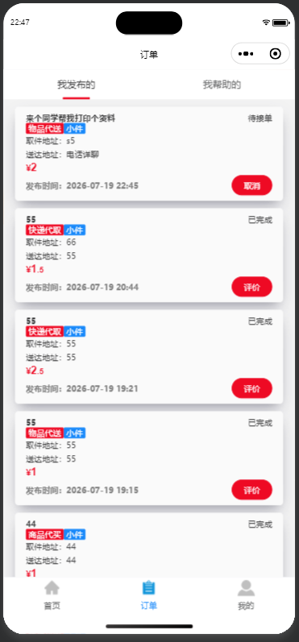
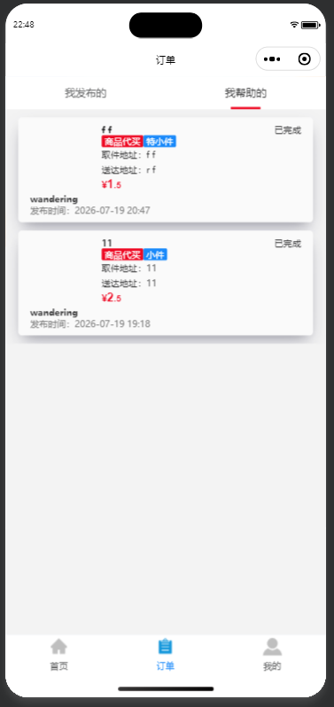
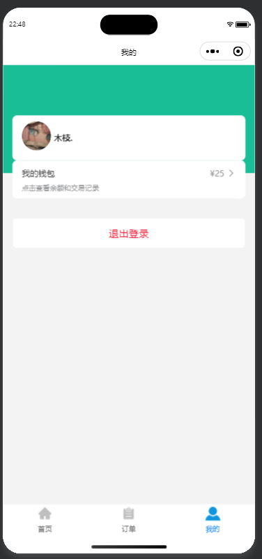
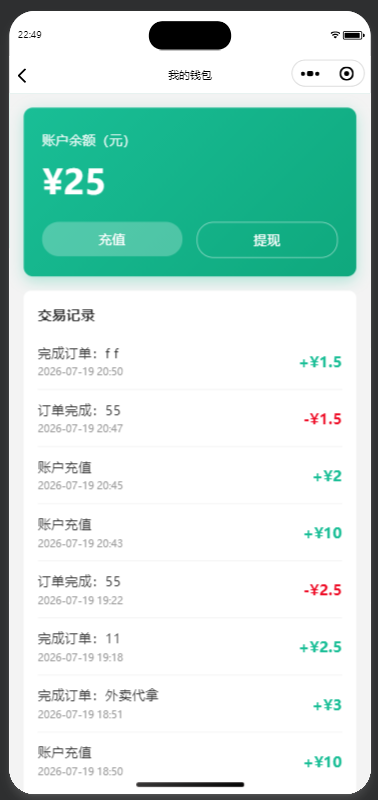
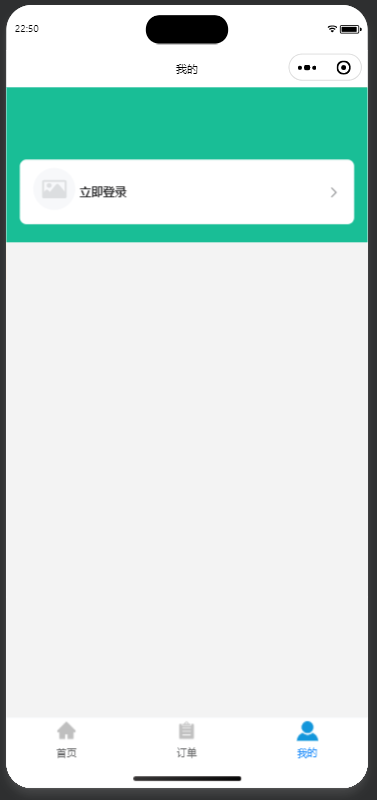

# 新工快送 - 校园跑腿服务平台

> 基于微信小程序与云开发的校园互助跑腿平台，专为新乡工程学院师生打造。

## 项目简介

新工快送是一个面向高校校园场景的跑腿互助微信小程序。用户可一键发布跑腿需求（快递代取、外卖代拿、商品代买、物品代送等），其他同学在线接单并完成配送，平台内置钱包系统实现酬劳结算。本项目为毕业设计作品，技术栈选用微信小程序原生框架 + 云开发，适合新手学习和二次开发。

## 功能概览

- **用户登录**：微信一键授权登录，获取用户头像和昵称
- **发布订单**：选择跑腿类型（快递/外卖/商品/其他），填写描述、地点、酬劳等信息
- **接单大厅**：首页展示所有待接订单，点击"帮Ta"展开详情并接单
- **订单管理**：按"我发布的"和"我帮助的"分类查看，支持订单状态实时跟踪
- **订单状态流转**：待接单 → 进行中 → 待确认 → 已完成（两步确认机制保障双方权益）
- **钱包系统**：虚拟充值、余额显示、交易记录，订单完成后自动结算酬劳
- **退出登录**：支持切换账号，清除本地缓存

## 截图预览

### 首页与接单
<div align="center">
  
  
  
</div>

### 个人中心与钱包
<div align="center">
  
  
  
</div>

## 技术栈

| 分类 | 技术 |
|------|------|
| 前端框架 | 微信小程序原生框架 |
| UI 组件库 | [Vant Weapp](https://vant-ui.github.io/vant-weapp/) |
| 后端服务 | 微信云开发（云函数 + 云数据库 + 云存储） |
| 数据库 | 云开发文档型数据库 |
| 开发工具 | 微信开发者工具 |

## 项目结构

```
campus-errand/
├── miniprogram/                  # 小程序前端代码
│   ├── pages/
│   │   ├── index/                # 首页（接单大厅）
│   │   ├── orders/               # 订单列表页
│   │   │   └── comment/          # 评价页面
│   │   ├── mine/                 # 我的（个人中心）
│   │   ├── publish/              # 发布订单页
│   │   ├── orderDetail/          # 订单详情页
│   │   └── wallet/               # 钱包页
│   ├── custom-tab-bar/           # 自定义底部导航栏
│   ├── images/                   # 图片资源
│   ├── utils/                    # 工具函数
│   ├── miniprogram_npm/          # npm 依赖（Vant Weapp）
│   ├── app.js                    # 小程序入口
│   ├── app.json                  # 全局配置
│   └── app.wxss                  # 全局样式
├── cloudfunctions/               # 云函数
│   ├── login/                    # 用户登录
│   ├── getOrderList/             # 获取订单列表
│   ├── getOneOrder/              # 获取单个订单详情
│   ├── updateOrder/              # 更新订单状态（接单/完成/确认）
│   ├── walletRecharge/           # 钱包充值
│   ├── walletPay/                # 钱包支付
│   ├── walletSettle/             # 钱包结算
│   ├── walletCompleteOrder/      # 订单完成结算（扣款+入账）
│   ├── addMockOrder/             # 测试订单生成
│   └── clearMockOrders/          # 清除测试订单
├── docs/                         # 毕业设计文档
│   ├── 新工快送-毕业论文.docx
│   └── 新工快送-操作文档.docx
├── 截图/                         # 项目截图
├── project.config.json           # 项目配置文件
└── .gitignore
```

## 快速开始

### 环境要求

- [微信开发者工具](https://developers.weixin.qq.com/miniprogram/dev/devtools/download.html)（最新稳定版）
- 已注册的微信小程序 AppID（个人主体即可）
- 开通微信云开发（需购买基础套餐，约 9.9-19.9 元/月）

### 部署步骤

**1. 克隆项目**

```bash
git clone https://github.com/wanuo54/campus-errand-platform.git
```

**2. 修改 AppID**

用微信开发者工具打开项目，将 `project.config.json` 中的 `appid` 字段修改为你自己的小程序 AppID。

**3. 开通云开发**

在微信开发者工具中点击「云开发」按钮，开通云开发环境，记录环境 ID。

**4. 修改云环境 ID**

将 `miniprogram/app.js` 中 `wx.cloud.init()` 的 `env` 参数改为你的云环境 ID。

**5. 创建数据库集合**

在云开发控制台 → 数据库中，手动创建以下集合（权限均设为「所有用户可读，仅创建者可写」）：

| 集合名 | 说明 |
|--------|------|
| `order_list` | 订单列表 |
| `user_info` | 用户信息 |
| `wallet` | 钱包余额 |
| `wallet_record` | 钱包交易记录 |

**6. 安装 npm 依赖**

在 `miniprogram` 目录下执行：

```bash
npm install
```

然后在微信开发者工具中点击「工具」→「构建 npm」。

**7. 部署云函数**

在微信开发者工具中，逐个右键点击 `cloudfunctions` 下的每个云函数文件夹，选择「上传并部署：云端安装依赖」。

**8. 编译运行**

点击微信开发者工具工具栏的「编译」按钮，即可在模拟器中预览。

## 订单状态流转

```
发布订单 → [待接单] → 他人接单 → [进行中] → 接单者申请完成 → [待确认] → 发布者确认 → [已完成] → 自动结算
```

- 已被接单的订单不可被其他人再次接单
- 完成后由发布者确认，确认后自动从发布者钱包扣款、向接单者钱包入账
- 首页仅展示「待接单」状态的订单

## 注意事项

- 本小程序使用**个人主体**注册，不支持地图/定位插件
- 云开发免费额度已取消，需购买基础套餐才能使用
- 云函数修改后需重新部署才能生效
- 测试多用户场景时，需要使用两个真实微信账号分别在开发者工具和真机上登录
- 虚拟充值功能仅用于演示，实际部署时需替换为真实支付接口

## 毕业设计文档

项目配套文档位于 `docs/` 目录：

- **操作文档**：包含完整的环境准备、部署流程、功能演示步骤和常见问题排查
- **毕业论文**：按照本科毕业论文标准撰写，包含需求分析、系统设计、实现细节和测试报告

## License

本项目仅用于学习交流与毕业设计用途。